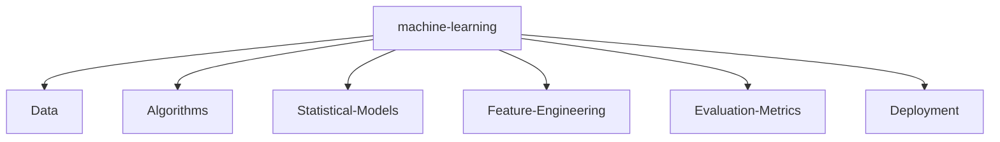

# Artificial-intelligence

## 1、ℹ️Information

- 人工智能学习个人代码仓库 

 - [个人博客链接🔗](https://blog.csdn.net/quantumyou/category_12627876.html?spm=1001.2014.3001.5482)
 - 如果遇到了任何问题，欢迎提出 Issues，但是更欢迎直接提交 Pull Request

## 2、🔨StudyMaps



## 3、🎨CodeStructure

```text

├── README.md
├── pytorch
├────── cifar_code   
├────── tensor
├────── network classification_code             
├────── Pytorch_Lightning_Compare_code
├──────────── Lightning_MNIST.py    
├──────────── Torch_MNIST.ipynb
├────── pytorch的工具函数保存pth.py
├────── RNN.ipynb


```

 

